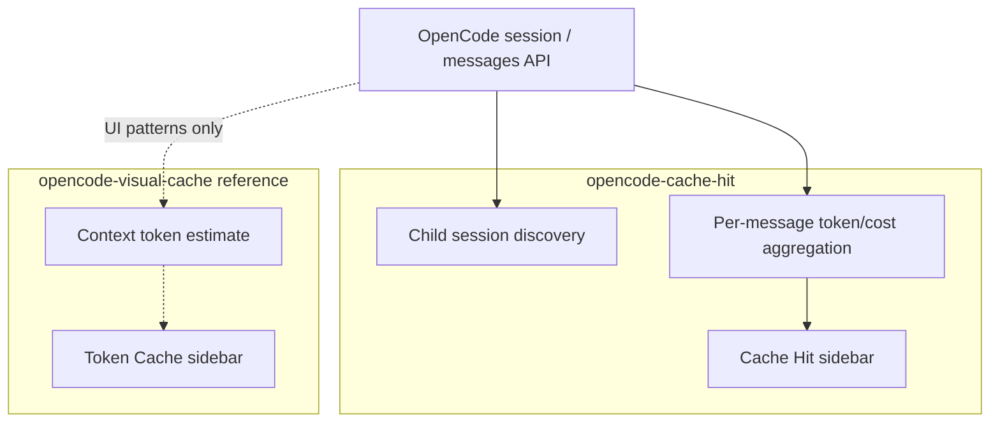
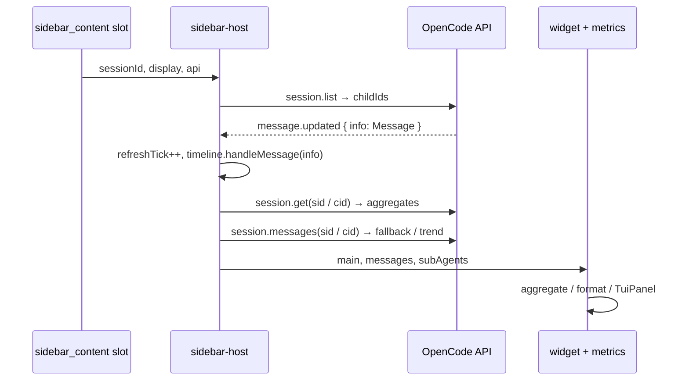
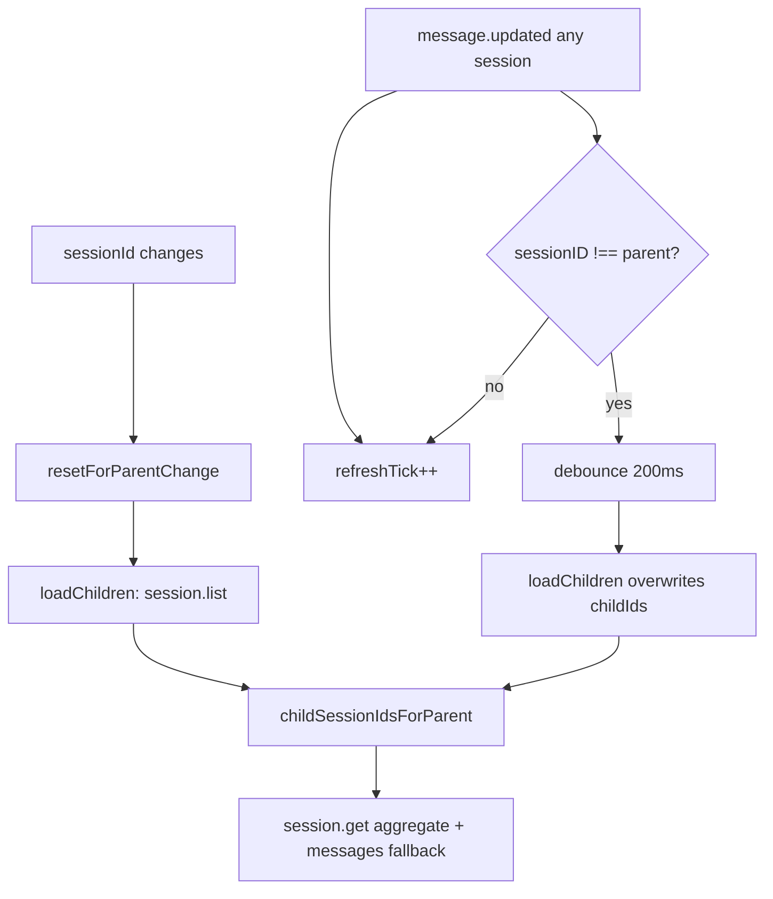

# Design

For **maintainers** of this plugin: data flow, refresh rules, and boundaries vs [opencode-visual-cache](https://www.npmjs.com/package/opencode-visual-cache). User setup: [README.md](../../README.md).

## Relationship to opencode-visual-cache

This is a **separate project**, not maintained by the visual-cache authors. It **borrows heavily** from [opencode-visual-cache](https://www.npmjs.com/package/opencode-visual-cache):

- **Sidebar panel layout** (`src/tui-panel/`): borders, hit bar, foldable sections, theme palette mapping
- **Layout**: main session block always visible; collapsible **Agents** section when sub-agents exist
- **Hit rate convention**: session totals align with visual-cache’s `cache.read / (cache.read + input)` rule

**Division of labor**: visual-cache focuses on **main-session context / token distribution estimates**; cache-hit focuses on **per-turn metrics, cost, and sub-agent aggregation**. Install both for a complete picture.

See the [documentation index](../README.md).

## Product boundary



| Role | Responsibility |
|------|----------------|
| **cache-hit** | Sub-agent discovery and rollup; cache, tokens, cost for main/child sessions |
| **visual-cache** | Main-session context and estimates; not maintained in this repo |
| **Default** | Main block + foldable **Agents** (child-session totals) |

## Cost model

- OpenCode: `msg.cost` accumulates assistant messages using **USD** list prices from `opencode.json`.
- Plugin: `createCostFormatter(loadPluginConfig().cost)`; default `costUnit: USD` → `currency: CNY`, `rate: 6.77`.
- Config file: `~/.config/opencode/cache-hit.json` (preferred) or `cache-hit.config.json` at plugin root (legacy). Defaults in `plugin-config.ts`.

## Dynamic pricing (`dynamicPricing`)

Two orthogonal price dimensions resolve to the effective per-1M rates shown in the sidebar:

- **Context tier**: reads the runtime cost tiers from `state.provider` (`tiers[]` / `experimentalOver200K`, normalized into the internal context tier with its own threshold); picks the tier by total context (`input + cacheRead`) vs the threshold (per-model config > runtime tier size > global > 200k). Zero-config for models like GPT-5.6.
- **Time-of-day tier**: `schedule` (default DeepSeek peak Mon–Fri 09:00-12:00 / 14:00-18:00 Beijing, off-peak otherwise) + per-model `multipliers` (default DeepSeek off-peak 0.5×) or absolute `levels` (level miss falls back to static rates; `enabled: false` restores fully static pricing). Windows may carry an optional `days` list (ISO 1=Monday…7=Sunday; omitted = every day); a level with empty `windows` is the **catch-all fallback** (e.g. the default `offpeak`, which covers weekends). Cross-midnight windows anchor to their open day (evening part on `days` day, morning part on the next day).

Lookup fallback chain (`src/dynamic-pricing/lookup.ts`): explicit `levels` → explicit `multipliers` → built-in DeepSeek default → static `state.provider` cost.

- `src/dynamic-pricing/schedule.ts`: timezone-aware window matching (`Intl.DateTimeFormat`), `nextBoundaryMs` drives a `setTimeout`-based refresh in `use-cache-hit-metrics.ts` — no polling.
- Session cost recompute (`src/dynamic-pricing/recompute.ts`): per message, `msg.time.created` selects the tier, total context (`input + cacheRead`) the context tier; `tokens.input` excludes cache, so cache reads are billed separately at `cacheReadRate`. Shown with `≈` when dynamic rules applied.
- Sub-agents: `session.list` entries carry `time.created` (`src/session-list.ts` → `child-session-sync.ts`), so each child's cost can be recomputed at its creation time (`recomputeSubAgentCost`).
- Timeline dashboard (`scripts/timeline-dashboard.ts`): offline recompute reads provider rates from `~/.config/opencode/opencode.json` (JSONC-aware) and injects `dynCost` per `LlmCallRecord` (shown with `≈`, counted in charts/totals).

## Runtime architecture



### Module map

| File | Role |
|------|------|
| `plugin.tsx` | `api.slots.register` (`order: 56`, next to visual-cache); load config |
| `sidebar-host.tsx` | Bind `sessionId`; `mainSnap` / `mainMessages` / `subAgentList`; `refreshTick` + `message.updated` |
| `widget.tsx` | Render panel when `sessionId` set; `noData` when empty |
| `use-cache-hit-metrics.ts` | Hit row, trend, main block visibility |
| `main-session-view.tsx` / `agents-view.tsx` | Business sections |
| `cache-hit-rows.tsx` | Shared token rows in Detail |
| `stats.ts` | Pure aggregation (no UI) |
| `session-list.ts` | Parse `session.list`, `childSessionIdsForParent` |
| `format-cost.ts` / `format-tokens.ts` / `format-cache-ui.ts` | Display formatting (`computeHitBarWidth` lives in `tui-panel/layout.ts`) |
| `format-model.ts` | Sub-agent row label (`formatSubAgentLabel`) and vendor brand colors (`modelRowColor`) |
| `message-timing.ts` | SDK time fields |
| `token-speed.ts` / `streaming-state.ts` | Speed calculations & streaming phase state machine |
| `timeline/` | Per-call JSONL (`records` / `writer` / `collector`) |
| `plugin-config.ts` / `load-config.ts` | Config normalization |

### TUI panel framework (`src/tui-panel/`)

Reusable **page** skeleton aligned with visual-cache (layout, colors, foldable sections)—no skills estimate, slash, or kv business logic.

| Module | Role |
|--------|------|
| `layout.ts` | Column widths, `justifyRow`, `computeHitBarWidth`, separators |
| `palette.ts` | Theme → panel palette; `toneBrandHex` for vendor colors on dark panels |
| `use-panel-layout.ts` | `createPanelLayout`, `createSectionFold` |
| `components.tsx` | `TuiPanel`, `TuiHitRow`, `TuiMetricRow` (`labelFg` / `valueFg` split colors), … (`@opentui/solid`) |
| `index.ts` | Barrel export |

Import `layout.ts` / `palette.ts` directly from non-JSX code (e.g. `use-cache-hit-metrics`) so `bun test` smoke tests do not pull JSX.

See [src/tui-panel/README.md](../../src/tui-panel/README.md) · [中文](../../src/tui-panel/README.zh-CN.md).

## Sub-agent discovery

Implementation: `src/child-session-sync.ts` (used by `sidebar-host`).



- **Single source of truth**: `childIds` always **replaced** from `session.list` (no `session.get` append).
- **Races**: `listGen` increments on parent change; callbacks check generation and `parentId`.
- **Streaming**: foreign-session `message.updated` is debounced (`CHILD_LIST_DEBOUNCE_MS` = 200ms).
- **Depth**: direct children only (`parentID === sid`); nested sub-agents are future work.
- **Data**: `session.get(cid)` → `aggregateFromSessionObject` (primary); falls back to `messages(cid)` → `aggregateSessionFromMessages`. Model/provider metadata is patched from messages when missing from session aggregates (`withModelFallback`).

### Agents block semantics

| Scope | Included in Agents total? |
|-------|-------------------------|
| Each child session’s assistant messages | Yes (`aggregateSubAgents`) |
| Main session assistant messages | **No** (still in `mainSnap` when hidden in UI) |

The UI shows `agentsScopeHint` (“sub-sessions only”). This complements visual-cache’s main-session view—it is not a missing-aggregation bug.

### Sub-agent row display

When multiple child sessions run in parallel, each active sub-agent gets a metric row under **Agents** (see screenshot `docs/assets/cache-hit-panel.v4.png`).

| Aspect | Behavior |
|--------|----------|
| **Purpose** | Distinguish which child session and which model in a narrow sidebar |
| **Label text** | `{displayModelName} …{sessionIdTail}` — same naming rules as the main **Model** row (`shortModelName` + date-suffix strip); **no** semantic nicknames (`ds-flash`, etc.) |
| **Truncation** | `gauge` ≈ measured panel width − border gutter; label budget subtracts right-side cost/tokens. Prefer keeping the **model prefix**; shrink ID tail (6 → 4 chars) before dropping the tail |
| **Label color** | Approximate **vendor brand** hex (`MODEL_BRAND_HEX` in `format-model.ts`), passed through `toneBrandHex` for legibility on dark terminals |
| **Value color** | `muted` — separate from label so row cost is not confused with Agents total **Cost** (`success` green) |
| **Family match** | `MODEL_FAMILY_RULES` (claude, deepseek, openai, gemini, qwen, glm, kimi, minimax, grok, mimo, meta, mistral); matching is **case-insensitive** on model slug and `providerID` |
| **Unknown models** | Stable hash → neutral fallback hues (never `success`) |
| **Config** | No `cache-hit.json` keys in v1; extend `MODEL_FAMILY_RULES` / `MODEL_BRAND_HEX` in code |

Implementation: `agents-view.tsx` calls `formatSubAgentLabel` + `modelRowColor`; `TuiMetricRow` uses `labelFg` / `valueFg`.

## Aggregation and refresh

### When values recompute

| Data | Trigger |
|------|---------|
| Main snapshot | `createMemo` reads `refreshTick` + `session.get?.(sid)` (aggregate); fallback `messages(sid)` |
| Main messages (Hit trend) | `createMemo` reads `refreshTick` + `messages(sid)` |
| Sub-agent content | `refreshTick` + `childIds` → `session.get?.(cid)` per child; fallback `messages(cid)` |
| Sub-agent ids | `session.list` callback / debounced refresh on foreign activity |

`sidebar-host` subscribes to `message.updated` and bumps `refreshTick` so dependent memos recompute; session totals follow `session.get()` aggregates, while per-turn trend follows recent messages.

### session.get() availability

`session.get()` provides DB-level aggregates (not capped at 100 messages), but was added in [opencode#26644](https://github.com/anomalyco/opencode/pull/26644) (2026-05-12). Forks that split before this commit — including MiMo-Code — lack the method. The code uses optional-chaining (`get?.()`) and falls back to `session.messages()`, which returns at most the 100 most recent assistant messages per call.

### Accumulation rules

- Every `role === assistant` message in the session is included—not only the last turn.
- Streaming updates the same message’s `tokens` repeatedly.
- `reasoning` tokens are **excluded** from hit-rate denominator.
- `summary: true`: skipped in `computePerCallHitTrend`; **not** yet excluded in `aggregateSessionFromMessages`.

### Sidebar visibility

```mermaid
flowchart TD
  S{sessionId set?}
  S -->|no| H[no panel]
  S -->|yes| P[TuiPanel]
  P --> D{hasData?}
  D -->|no| ND[noData]
  D -->|yes| MAIN[Main / Detail / Model]
  D -->|has subs| AG[Agents (foldable)]
```

| Concept | Implementation |
|---------|----------------|
| Whole panel | `widget.tsx`: `Show when={sessionId().length > 0}` |
| Has data | `mainSessionHasStats(main) \|\| subs.length > 0` |
| Main **block** | Always rendered |
| **Agents** | Shown when `subs.length > 0`; foldable |

## Hit rate (current)

**Session total (Total Hit, aligned with visual-cache)**

```
Sum input and cache.read over assistant messages
→ cacheRead / (cacheRead + input)
```

**Header Hit (per-turn + trend)**

- `computePerCallHitTrend`: one rate per assistant turn; skip `summary: true`.
- Display the **last** non-summary turn; compare to previous for ↑ / ↓ / `-`.

**Pricing & Saved**

- Provider pricing is read from `api.state.provider` (SDK runtime data, not hardcoded).
- `computePricing` looks up per-million rates by `providerID` + `modelID`; computes `saved = (inputRate - cacheReadRate) * cacheRead / 1M`.
- Main session: **Saved** row in Detail section; per-million rates (`/M in`, `/M cache`, `/M out`) in Model section.
- Agents section: **Saved** row sums savings across all child sessions (`computeSubsSaved`).
- All pricing rows hidden when rates are unavailable or saved is zero.

## Time fields (OpenCode SDK v2)

| Source | Field | Notes |
|--------|-------|-------|
| `AssistantMessage` | `time.created` | ms epoch |
| `AssistantMessage` | `time.completed?` | end of LLM turn; often missing while streaming |
| `ReasoningPart` | `time.start` / `time.end?` | thought segments |
| `ToolStateCompleted` | `time.start` / `time.end` | tool run |
| `StepFinishPart` | (no time) | tokens/cost; time falls back to message |

**Per-call JSONL (Phase 1, default off)**: one row per assistant turn; daily file under `logs/`. See **[timeline.md](./timeline.md)** § Storage, § Rotation and retention.

## Testing

| Layer | Files | Purpose |
|-------|-------|---------|
| Unit | `tests/*.test.ts` | `stats`, `format-*`, layout, timeline |
| Smoke | `tests/module-load.test.ts` | Real import graph |
| Runtime | OpenCode logs | JSX / peer load errors |

After moving exports: `rg` + `bun test`.

## Roadmap (not implemented)

| Item | Notes | Doc |
|------|-------|-----|
| Per-call JSONL | **Phase 1 done** (`src/timeline/`, default off) | [timeline.md](./timeline.md) |
| Metric modes | Session / last N / sliding window | timeline.md § Phase 3 |
| Sub-agents | Recursive children, filter by agent type | timeline.md § Risks |

Timeline writes must stay async and non-blocking (see timeline.md).

## Plugin cache

| Install | After code change |
|---------|-------------------|
| Local path | Restart OpenCode |
| npm package | Restart; clear `~/.cache/opencode/packages/opencode-cache-hit@latest` if needed |
