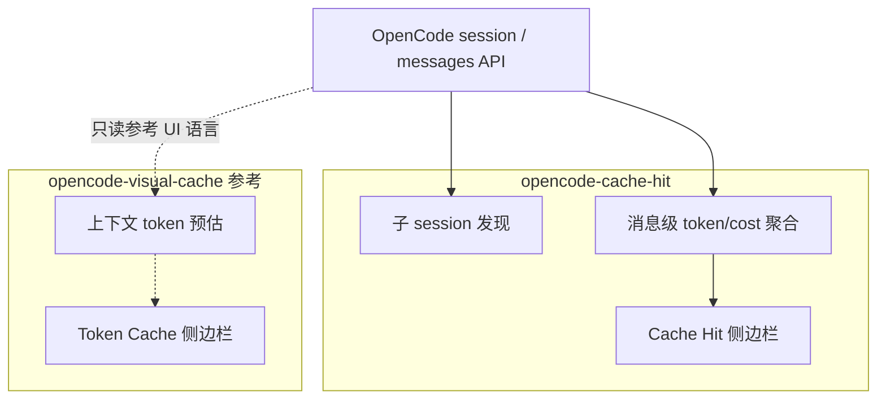
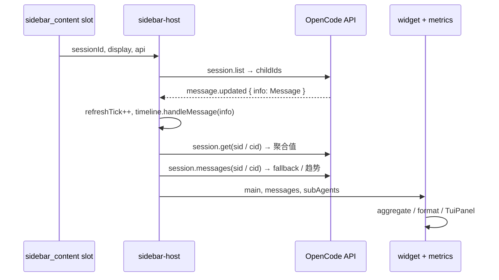
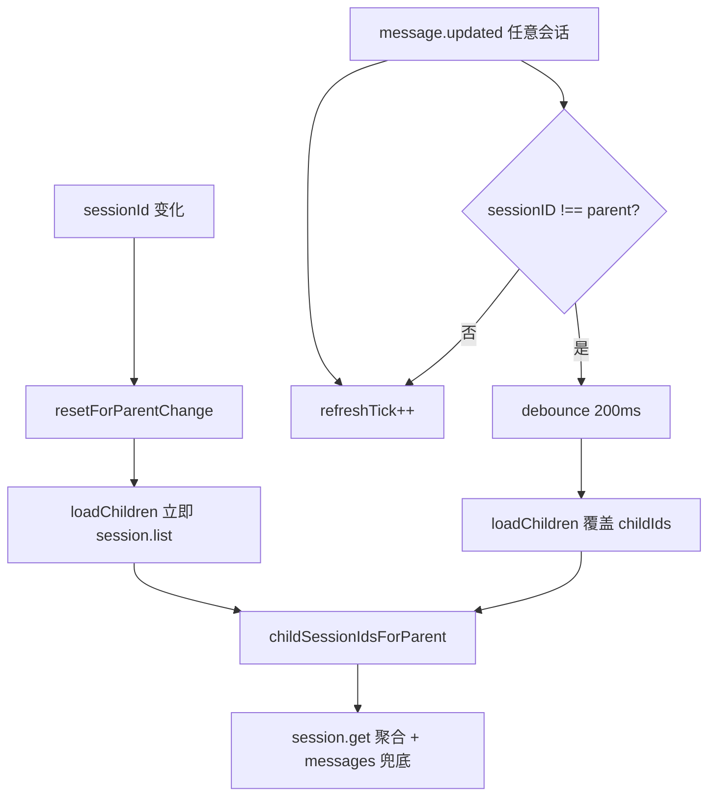
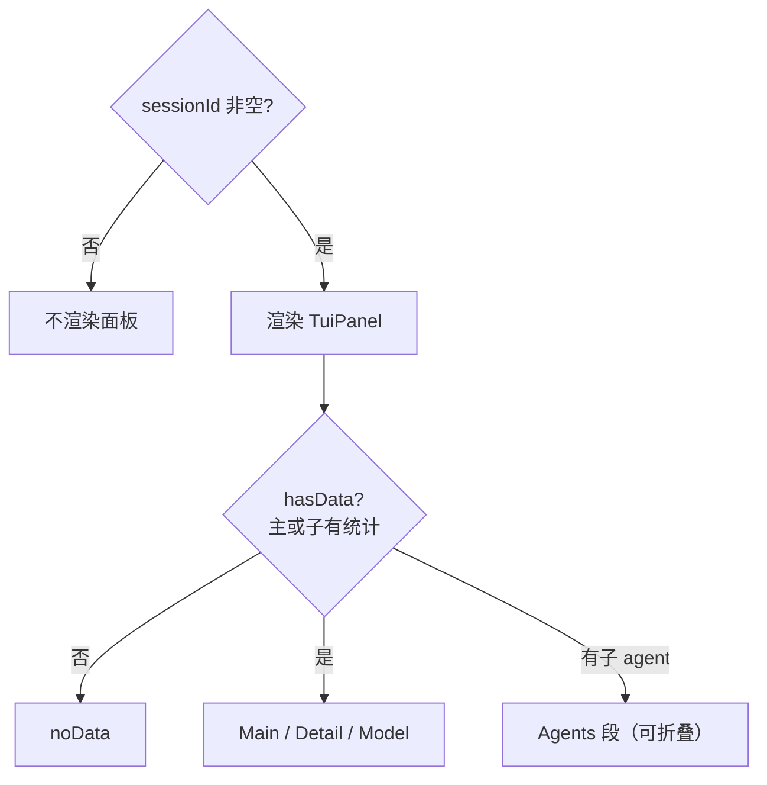

# 设计说明

面向**维护本插件的开发者**：说明数据从哪来、何时重算、与 visual-cache 的边界。使用与配置见 [README.zh-CN.md](../../README.zh-CN.md)。

## 与 opencode-visual-cache 的关系

本插件是**独立项目**，并非 visual-cache 官方维护。实现上**大量借鉴**了 [opencode-visual-cache](https://www.npmjs.com/package/opencode-visual-cache) 的思路，包括但不限于：

- **侧栏面板布局**（`src/tui-panel/`）：边框、命中率条、折叠段、主题色映射等页面骨架
- **布局**：主 session 块始终显示；有子 agent 时增加可折叠的 **Agents** 段
- **命中率口径**：会话累计与 visual-cache 的 `cache.read / (cache.read + input)` 约定对齐

**分工**：visual-cache 侧重主 session **上下文 / token 分布预估**；cache-hit 侧重**按轮次指标、成本与子 agent 汇总**。推荐两个插件一起装。

用法见 [文档索引](../README.md)。

## 产品边界



| 角色 | 职责 |
|------|------|
| **cache-hit** | 子 agent 发现与汇总；主/子 session 的 cache、token、成本；可独立演进 |
| **visual-cache** | 主 session 上下文与预估；非本仓库维护 |
| **默认** | 主 session + 可折叠 **Agents**（子 session 合计） |

## 成本模型

- OpenCode：`msg.cost` = 按 `opencode.json` 中**美元**单价对 assistant 消息累加。
- 插件：`createCostFormatter(loadPluginConfig().cost)`；默认 `costUnit: USD` → `currency: CNY`，`rate: 6.77`。
- 配置路径：优先 `~/.config/opencode/cache-hit.json`，兜底插件根目录 `cache-hit.config.json`。缺省见 `plugin-config.ts` 的 `DEFAULT_PLUGIN_CONFIG`。

## 动态计价（`dynamicPricing`）

两个正交的价格维度决定侧边栏显示的有效百万 token 单价：

- **上下文档位**：读取 `state.provider` 的运行时 cost 档位（`tiers[]` / `experimentalOver200K`，内部归一化为上下文档并携带自身阈值）；按总上下文（`input + cacheRead`）与阈值选档（模型级配置 > 运行时档位阈值 > 全局 > 200k）。GPT-5.6 类模型零配置生效。
- **时段档**：`schedule`（默认 DeepSeek 高峰为北京时间**周一至周五** 09:00-12:00 / 14:00-18:00，其余含周末为空闲）+ 单模型 `multipliers`（默认 DeepSeek 空闲 0.5×）或绝对价 `levels`（时段未命中回退静态价；`enabled: false` 恢复完全静态计价）。窗口可带可选 `days`（ISO 1=周一…7=周日；省略 = 每天）；`windows` 为空的 level 即「**回退档**」（默认 `offpeak` 兜底周末等一切未覆盖时刻）。跨天窗口锚定开启日（`days` 日承载晚间段，次日承载早晨段）。

查找回退链（`src/dynamic-pricing/lookup.ts`）：显式 `levels` → 显式 `multipliers` → 内置 DeepSeek 默认 → `state.provider` 静态价。

- `src/dynamic-pricing/schedule.ts`：基于时区的窗口匹配（`Intl.DateTimeFormat`，含 `tzWeekdayOf` 星期判定），`nextBoundaryMs` 星期感知地驱动 `use-cache-hit-metrics.ts` 中 `setTimeout` 精确刷新（周五 18:00 后直达周一 09:00，周末不轮询）——无需轮询。
- 会话成本重算（`src/dynamic-pricing/recompute.ts`）：逐消息用 `msg.time.created` 选时段、总上下文（`input + cacheRead`）选上下文档；`tokens.input` 不含缓存，缓存命中部分按 `cacheReadRate` 单独计费。动态规则生效时展示标注 `≈`。
- 子 agent：`session.list` 条目携带 `time.created`（`src/session-list.ts` → `child-session-sync.ts`），可按子会话创建时刻重算成本（`recomputeSubAgentCost`）。
- 时间轴看板（`scripts/timeline-dashboard.ts`）：离线重算读取 `~/.config/opencode/opencode.json`（JSONC 感知）的 provider 单价，逐条向 `LlmCallRecord` 注入 `dynCost`（`≈` 展示并计入图表/合计）。

## 运行时架构



### 模块职责

| 文件 | 职责 |
|------|------|
| `plugin.tsx` | `api.slots.register`（`order: 56`，紧邻 visual-cache）；加载配置与 `formatCost` |
| `sidebar-host.tsx` | 绑定 `sessionId`；`mainSnap` / `mainMessages` / `subAgentList`；`refreshTick` + `message.updated` |
| `widget.tsx` | `sessionId` 非空则渲染面板；`hasData` 否则 noData |
| `use-cache-hit-metrics.ts` | Hit 条、趋势、Combined Hit、hasData |
| `main-session-view.tsx` / `agents-view.tsx` | 业务区块 |
| `cache-hit-rows.tsx` | Detail 区共用 token 行 |
| `stats.ts` | 纯函数聚合（无 UI） |
| `session-list.ts` | `session.list` 响应解析、`childSessionIdsForParent` |
| `format-cost.ts` / `format-tokens.ts` / `format-cache-ui.ts` | 展示格式化（**不含** `computeHitBarWidth`，其在 `tui-panel/layout.ts`） |
| `format-model.ts` | 子 agent 行 label（`formatSubAgentLabel`）与厂商品牌色（`modelRowColor`） |
| `message-timing.ts` | SDK 时间字段辅助 |
| `token-speed.ts` / `streaming-state.ts` | 速度计算与流式 phase 状态机 |
| `timeline/` | 按次 JSONL（`records` / `writer` / `collector`） |
| `plugin-config.ts` / `load-config.ts` | 配置归一化与默认值 |

### TUI 面板框架（`src/tui-panel/`）

可复用的 visual-cache **页面**骨架（布局、配色、折叠段），**不含** skills 预估、slash、kv 等业务。

| 模块 | 职责 |
|------|------|
| `layout.ts` | 视觉列宽、`justifyRow`、`computeHitBarWidth`、分隔线 |
| `palette.ts` | 主题色 → 面板调色板；`toneBrandHex` 用于深色面板上的厂商色 |
| `use-panel-layout.ts` | `createPanelLayout`（测宽）、`createSectionFold` |
| `components.tsx` | `TuiPanel`、`TuiHitRow`、`TuiMetricRow`（`labelFg` / `valueFg` 分段上色）等（需 `@opentui/solid`） |
| `index.ts` | 对外 barrel |

纯逻辑模块（如 `use-cache-hit-metrics`）应从 `layout.ts` / `palette.ts` 直接 import，避免经 `index.ts` 拉入 JSX（便于 `bun test` 冒烟）。

用法见 [src/tui-panel/README.zh-CN.md](../../src/tui-panel/README.zh-CN.md)。

## 子 agent 发现

实现：`src/child-session-sync.ts`（`sidebar-host` 调用）。



- **唯一来源**：`childIds` 始终由 `session.list` 结果**覆盖**写入，不再 `session.get` + 追加（避免漏发现、僵尸 id）。
- **竞态**：`listGen` 在 parent 切换时递增；回调校验 generation 与 `parentId` 未变。
- **流式**：外国 session 的 `message.updated` 很密，用 `CHILD_LIST_DEBOUNCE_MS`（200ms）合并 list 请求。
- **一层子 session**：`parentID === sid` 的直接子节点；嵌套子 agent 见「未来方向」。
- **子 session 数据**：`session.get(cid)` → `aggregateFromSessionObject`（主路径）；不可用时降级到 `messages(cid)` → `aggregateSessionFromMessages`。若 session 聚合缺少 model/provider 元数据，从 messages 末尾补齐（`withModelFallback`）。

### Agents 合计语义（实现正确，勿与「全场总账」混淆）

| 范围 | 是否计入 Agents 段 |
|------|-------------------|
| 各子 session 的 assistant 消息 | 是（`aggregateSubAgents`） |
| 主 session 的 assistant 消息 | **否**（即使在 auto 下仍会计入 `mainSnap`，仅 UI 隐藏主块） |

主 session 若仍有编排类调用，其 token/费用不会出现在 Agents 合计中；UI 通过 `agentsScopeHint`（「仅子会话 / sub-sessions」）标明。与 visual-cache 对主 session 的展示互补，不是漏算 bug。

### 子 session 行展示

多个子 session 并行时，**Agents** 段下每个有活动的子 session 一行（见截图 `docs/assets/cache-hit-panel.v4.png`）。

| 方面 | 行为 |
|------|------|
| **目的** | 在窄侧栏中辨认「哪条子 session、用的什么模型」 |
| **Label 文案** | `{displayModelName} …{sessionIdTail}` — 与主块 **Model** 行同源（`shortModelName` + 去日期尾）；**不做**语义缩写（如 `ds-flash`） |
| **截断** | `gauge` ≈ 实测面板宽 − 边框 gutter；label 预算再减去右侧 cost/tok。优先保留**模型前缀**；先缩短 ID 尾（6 → 4 字符） |
| **Label 颜色** | 厂商近似品牌色（`MODEL_BRAND_HEX`，经 `toneBrandHex` 压低饱和度以适配深色终端） |
| **金额颜色** | `muted`，与 label 分开，避免与 Agents 合计 **Cost** 的 `success` 绿色混淆 |
| **Family 匹配** | `MODEL_FAMILY_RULES`（claude、deepseek、openai、gemini、qwen、glm、kimi、minimax、grok、mimo、meta、mistral）；模型 slug 与 `providerID` **大小写不敏感** |
| **未知模型** | 稳定 hash → 中性 fallback 色（不用 `success`） |
| **配置** | v1 无 `cache-hit.json` 项；在代码中扩展 `MODEL_FAMILY_RULES` / `MODEL_BRAND_HEX` |

实现：`agents-view.tsx` 调用 `formatSubAgentLabel`、`modelRowColor`；`TuiMetricRow` 使用 `labelFg` / `valueFg`。

## 聚合与刷新

### 何时重算

| 数据 | 触发方式 |
|------|----------|
| 主 session snapshot | `createMemo` 内读 `refreshTick` + `session.get?.(sid)`（聚合）；fallback `messages(sid)` |
| 主 session 消息列表（Hit 趋势） | `createMemo` 内读 `refreshTick` + `messages(sid)` |
| 子 agent 列表内容 | `refreshTick` + `childIds` → 每个 child 的 `session.get?.(cid)`；fallback `messages(cid)` |
| 子 agent id 集合 | `session.list` 完成回调 / `message.updated` 发现新 child |

主 session **显式**订阅 `message.updated`（在 `sidebar-host`）：每次事件 `refreshTick++`，触发相关 memo 重算；会话总量以 `session.get()` 聚合为准，逐轮趋势使用最近 messages。

### session.get() 可用性

`session.get()` 提供数据库级聚合（不受 100 条消息限制），但在 [opencode#26644](https://github.com/anomalyco/opencode/pull/26644)（2026-05-12）才加入。在此之前 fork 的分支（含 MiMo-Code）缺少该方法。代码使用可选链调用（`get?.()`），fallback 到 `session.messages()`，后者每次调用最多返回最近 100 条 assistant 消息。

### 累加规则

- **不是**只在「最后一轮」算一次；session 内**每条** `role === assistant` 的消息都进入累加。
- **流式中**：同一条 message 的 `tokens` 可能多次变化；每次 `message.updated` 后重算。
- `reasoning` token **不参与**命中率分母。
- `summary: true` 的 assistant：在 `computePerCallHitTrend` 中**跳过**；会话累计器 `aggregateSessionFromMessages` **暂未**排除。

### 侧边栏可见性（避免与 README 混淆）



| 概念 | 实现 |
|------|------|
| 整个面板 | `widget.tsx`：`Show when={sessionId().length > 0}` |
| 有无可显示数据 | `hasData` = `mainSessionHasStats(main) \|\| subs.length > 0` |
| 主 session **区块** | 始终渲染（Hit / Detail / Model） |
| **Agents 段** | `subs.length > 0` 时显示，各段可独立折叠 |
| `sidebarShouldShow` | `mainSessionHasStats(main) \|\| subs.length > 0`（测试用） |

## 命中率（当前实现）

**会话累计（Total Hit 口径，对齐 visual-cache）**

```
对所有 assistant 消息累加 input、cache.read
→ cacheRead / (cacheRead + input)
```

**顶栏 Hit（单轮 + 趋势）**

- `computePerCallHitTrend(messages)`：每条 assistant 一轮命中率；`summary: true` 跳过。
- 展示**最后一条**非 summary 轮的命中率；与前一条比较得趋势（↑ / ↓ / `-`）。

**单价与节省（Pricing & Saved）**

- Provider 单价从 `api.state.provider`（SDK 运行时数据）读取，非硬编码。
- `computePricing` 根据 `providerID` + `modelID` 查找百万 token 单价；计算 `saved = (inputRate - cacheReadRate) * cacheRead / 1M`。
- 主 session：Detail 段展示 **Saved** 行；Model 段展示百万 token 单价（`/M 输入`、`/M 缓存`、`/M 输出`）。
- Agents 段：**Saved** 行汇总所有子 session 的节省金额（`computeSubsSaved`）。
- 单价不可用或节省为零时，所有 pricing 行隐藏。

## 时间字段（OpenCode SDK v2）

| 来源 | 字段 | 说明 |
|------|------|------|
| `AssistantMessage` | `time.created` | ms epoch，消息创建 |
| `AssistantMessage` | `time.completed?` | ms epoch，本轮 LLM 结束；流式中常缺失 |
| `ReasoningPart` | `time.start` / `time.end?` | thought 片段 |
| `ToolStateCompleted` | `time.start` / `time.end` | 工具执行 |
| `StepFinishPart` | （无 time） | 有 tokens/cost，时间回退到 message |

按次日志（**Phase 1 已实现**，默认关闭）：以 `AssistantMessage` 为一行，用 `created` + `completed` 排序；按**本地日历日**单文件 JSONL 落盘。实现：`src/timeline/`、`src/message-timing.ts`。路径、轮转与清理见 **[timeline.md](./timeline.md)**（本文档同目录）§ 存储、§ 轮转与清理。

## 测试策略

| 层级 | 文件 | 作用 |
|------|------|------|
| 单元 | `tests/*.test.ts` | `stats`、`format-*`、`tui-panel/layout` 等纯函数 |
| 冒烟 | `tests/module-load.test.ts` | `import` 消费者模块，捕获「符号已迁移但 import 路径未改」 |
| 运行时 | OpenCode 日志 | JSX / peer（`@opentui/solid`）加载错误；本地 `bun test` 不覆盖 |

重构移动 `export` 后：`rg` 旧符号名 + `bun test`。

## 未来方向（未实现）

| 方向 | 说明 | 设计文档 |
|------|------|----------|
| 按次 LLM + 时间轴 / JSONL | **Phase 1 已实现**（`src/timeline/`，默认关闭） | [timeline.md](./timeline.md) |
| 指标切换 | 累计 / 最近 N 轮 / 滑动窗口；与时间轴 Phase 3 联动 | timeline.md § Phase 3 |
| 子 agent | 递归子 session、按 agent 类型过滤 | timeline.md § 风险；侧栏另议 |

实现日志时使用 `message.updated` 事件直接驱动的 `handleMessage()`；落盘异步、勿阻塞 TUI（见 timeline.md）。

## 插件缓存

| 安装 | 更新 |
|------|------|
| 本地路径 | 重启 OpenCode |
| npm 包 | 重启；必要时删除 `~/.cache/opencode/packages/opencode-cache-hit@latest` |
