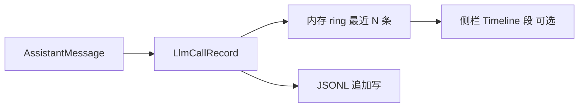
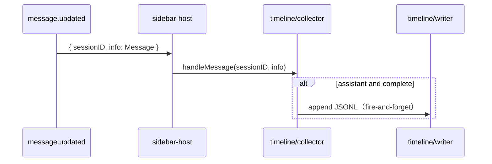

# 时间轴 / 按次日志 — 设计方案

面向开发者。侧栏聚合见 [design.md](./design.md)。用户指南见 [README.zh-CN.md](../../README.zh-CN.md)。

**Phase 1（JSONL 落盘）已实现**，默认 `timeline.enabled: false`。Phase 2 侧栏 Timeline 段、Phase 3 指标切换仍未做。

## 目标与非目标

| 目标 | 非目标 |
|------|--------|
| 按时间查看每次 assistant 调用的 token / cache / cost / 命中率 | 替代 OpenCode 平台日志（`~/.local/share/opencode/log`） |
| 区分主 session 与子 session 的调用 | 在 TUI 里实时 `console.log` 刷屏 |
| 本地落盘，便于事后用 jq / 脚本分析 | 上传云端、团队共享 |
| 与现有 `stats.ts` 口径一致（含 summary 与 compaction 跳过规则） | 第一期就做 SQLite、图表、递归子 agent |

## 核心概念

**一条时间轴事件 = 一次 assistant 轮次**。summary 或 compaction 行通过 `skippedForMetrics` 标记。交互指标行与侧栏顶栏 **Hit** 行同源，不是 tool part、不是 user 消息。



| 字段 | 来源 |
|------|------|
| 时间排序键 | `time.completed ?? time.created`（已有 `timingFromAssistantMessage`） |
| 是否计入 Hit 趋势 | `summary !== true`、`agent !== "compaction"` 且 `input + cache.read > 0` |
| 会话累计 | 使用带 interactive-message predicate 的 `aggregateSessionFromMessages` |

## 数据模型

```typescript
/** 单条记录；JSONL 一行一个 */
export type LlmCallRecord = {
  schema: 1
  /** 写入时间（ISO 8601，含时区），非 LLM 时间 */
  recordedAt: string
  /** 所属 session */
  sessionId: string
  /** 主 session id；子 session 时与 sessionId 不同 */
  rootSessionId: string
  scope: "main" | "child"
  /** OpenCode message id；SDK 若无则用稳定合成键，见下文 */
  messageKey: string
  modelId: string
  providerId?: string      // 记录时的 provider id（旧日志可能缺失）
  created: string
  completedAt?: string
  durationMs?: number
  isComplete: boolean
  input: number
  output: number
  reasoning: number
  cacheRead: number
  cacheWrite: number
  cost: number
  /** 单轮 cache 命中率 0–100；无分母时为 null */
  hitPercent: number | null
  /** compaction / summary 消息 */
  skippedForHit: boolean
  /** compaction / summary 消息；原始行仍可保留 */
  skippedForMetrics: boolean
  ttftMs?: number          // 首 Token 延迟（firstPartTime - created）
  ttftSource?: "sdk" | "tui"  // TTFT 数据来源
  tps?: number             // 每秒 Token 数（(output + reasoning) / genTime * 1000）
  tpot?: number            // 每个输出 Token 耗时（毫秒）(genTime / (output + reasoning - 1))
  itlP50?: number          // 流式 chunk 间延迟 P50（毫秒）
  itlP90?: number          // 流式 chunk 间延迟 P90（毫秒）
  itlCount?: number        // 采样的 chunk 间隔数
  finish?: string          // 完成原因（如 "stop", "tool-calls", "error"）
  toolDurations?: ToolDurationRecord[]  // 来自 src/tool-timing.ts
}
```

**`toolDurations`（各工具执行耗时）**

可选数组，记录该 assistant 轮次内已完成的 tool 调用。每个 tool 调用归属于触发它的 assistant 消息（按 `messageID` 匹配）。单条 assistant 消息可能触发多个 tool 调用（并行或串行），均记录在同一 `toolDurations` 数组中。

来自 `message.part.updated` 中 tool part 的 `running → completed` 或 `running → error` 转换。当 timeline 未开启、本轮无 tool、或 part 事件丢失时省略（与 TTFT 不同，**无** `api.state.part()` 回填）。`summary` 字段受 `timeline.toolSummary` 配置控制。

| 字段 | 说明 |
|------|------|
| `tool` | 工具名（如 `bash`、`read`、`grep`） |
| `summary?` | 隐私安全的摘要提示（见下表） |
| `durationMs` | part `state.time.start` 到 `state.time.end` 的墙钟耗时（优先 SDK 时间戳） |

**`summary` 提取规则**（已截断保护隐私；完整数据在 OpenCode sessions DB 中）：

| 工具 | 来源 | 示例 |
|------|------|------|
| `bash` | `command`（最长 60 字符） | `git add scripts/... && git commit --ame...` |
| `read`/`write`/`edit` | `filePath` 仅文件名 | `timeline-dashboard.ts` |
| `grep`/`glob` | `pattern`（最长 60 字符） | `TODO.*fix` |
| `webfetch` | hostname + pathname（去掉 query，最长 80 字符） | `example.com/api/data` |
| `task` | `description`（最长 60 字符） | `Find auth implementations` |
| `websearch` | `query`（最长 60 字符） | `OpenCode plugin API` |
| `lsp_*` | `filePath` 仅文件名（`lsp_diagnostics`、`lsp_symbols` 等） | `main.ts` |
| `question` | 首项 `header`，否则 `question`（最长 60 字符） | `Choose color` |

其他工具：仅写 `tool` 名；无 `summary`。

**隐私提示**：`bash` 命令可能包含凭据、令牌或敏感文件路径。summary 仅截断到 60 字符，不做脱敏处理。使用 `toolSummary.bash: false` 可在保留其他工具摘要的同时排除 bash 命令内容。

仅包含已到 `completed` 或 `error` 的工具；仍在 `running` 的不写入。若漏收 `running` 事件，会用终态事件上的 `state.time.start` 作为起点。若无法确定有效起点，该工具不会写入 `toolDurations`（避免错误时长）。

**内存 tracker（`toolTiming`）**

`src/tool-timing.ts` 按 `messageID` 维护 `Map<messageID, ToolTimingEntry[]>`，生命周期与当前主 session 绑定。JSONL 落盘后 **不会** 逐条清理（与 `firstPartTime` 相同）。内存随 assistant 轮次 × 每轮 tool 数增长，极长 session 通常为 KB 到低 MB 量级，不属于 GC 意义上的泄漏。切换主 session 时 `sidebar-host` 调用 `toolTiming.reset()`，插件卸载时 `dispose()` 清空。v1 不在 session 内做上限或逐条淘汰。

**`ttftMs` null 处理**

某条消息未捕获到首 part 时间时，`ttftMs` 可能缺失。侧边栏 **首Token** 使用同一 tracker，**不依赖** `timeline.enabled`；JSONL 仅在开启 timeline 落盘时写入 `ttftMs`。

捕获顺序（见 [ttft-hybrid.md](./ttft-hybrid.md)）：

1. `message.part.updated` — `text` / `reasoning` 的 `part.time.start`（SDK）
2. `message.part.delta` — 首个 `text` / `reasoning` 增量上的 `Date.now()`（TUI）
3. `message.updated` — 仍缺失时扫描 `api.state.part()` 取最早有效 `time.start`

全部失败时（如本地模型无 parts）省略 `ttftMs` — 部分 provider 下的预期行为。

**`ttftSource`（TTFT 数据来源）**

| 来源 | 描述 | 可靠性 |
|------|------|--------|
| `"sdk"` | `part.time.start` — SDK 收到首个流式 chunk 时的 `Date.now()`（来自 `message.part.updated` 或 `api.state.part()` 扫描） | ✅ 最精确（不含本地 IPC/事件循环延迟） |
| `"tui"` | 首个 `message.part.delta` 的 `Date.now()` | ✅ BusEvent 正常投递时可用 |

**优先级逻辑**：优先 SDK 端；一旦已有 SDK 端记录则不被 TUI 端覆盖。无效时间戳（`start <= created`）会被丢弃。

**`messageKey`（去重键）**

1. 优先：`message.id` / `messageID`。
2. 回退：`${sessionId}:${created}:${modelID ?? ""}`。

**流式与落盘**

- **内存**：每次 `handleMessage` 追加到 `collector.memoryRecords()`（受 `maxMemoryRows` 限制）。
- **落盘**：默认仅 `isComplete === true` 时 append；`flushIncomplete: true` 时也写未完成行。

## 从消息构建记录

事件驱动路径（`sidebar-host.tsx` → `timeline/collector.ts`）：

1. `message.updated` 携带一条 assistant `Message`。
2. `handleMessage(sessionID, msg)` 判定 scope（`sessionID === root` 为 `main`，在 `childIds` 内为 `child`）。
3. `src/timeline/records.ts` 的 `assistantMessageToRecord()` 生成一条 `LlmCallRecord`（TTFT 来自 `firstPartTime`，工具耗时来自 `toolTiming`）。
4. `timeline.enabled` 且满足 flush 规则 → append 一行 JSONL。

记录规则（`assistantMessageToRecord`）：

- 只处理 `role === assistant`。
- `skippedForHit = !isInteractiveAssistantMessage(msg)`。
- `skippedForMetrics = msg.summary === true || msg.agent === "compaction"`。
- `hitPercent` 与 `computePerCallHitTrend` 单条算法一致。
- 子 session：对 `childIds` 中的 `sessionID` 同样走 `handleMessage`（v1 不做批量合并排序）。

时间轴收集与侧栏过滤相互独立。`logSummaryMessages: true` 时，summary 和 compaction 行仍写入 JSONL，并标记 `skippedForMetrics: true`。这些行不会改变命中率、token、速度、费用、节省或 TTL 指标。

## 存储

**默认路径（可配置）**

```
~/.local/share/opencode/logs/cache-hit/
  timeline-2026-05-31.jsonl       # 按本地日历日一个活跃文件
  timeline-2026-05-31.jsonl.1     # 当日超过 rotateMaxBytes 时链式备份
```

所有主/子 session 的调用写入**同一天**的同一文件；用行内 `rootSessionId` / `sessionId` / `scope` 筛某场对话。跨日自动切到新文件名。

`dir` 非空时可改到例如 `~/my-logs/`，支持 `~/` 展开为 home 目录。

推荐 **JSONL** 第一期：实现简单、`tail -f` / `jq` 友好；SQLite 留给第二期索引查询。

**与旧版**：曾用 `<rootSessionId>.jsonl` 按主会话分文件；现改为按天。旧文件不会被自动迁移，可手动删除或保留。

**配置**（并入 `cache-hit.config.json` 的 `timeline` 段）：

```json
{
  "timeline": {
    "enabled": false,
    "dir": "",
    "flushIncomplete": false,
    "logSummaryMessages": true,
    "maxMemoryRows": 50,
    "maxLinesPerFile": 100000,
    "rotateMaxBytes": 16777216,
    "retainRotated": 5,
    "maxAgeDays": 30,
    "maxLogFiles": 20,
    "toolSummary": {
      "allTools": true,
      "bash": false
    }
  }
}
```

上表为 **example 推荐值**；代码默认见下表（`enabled: false`，轮转项为 `0`）。

| 字段 | 代码默认 | 说明 |
|------|----------|------|
| `enabled` | `false` | 关闭时零 IO，不影响侧栏 |
| `dir` | `""` | 空则用 `~/.local/share/opencode/logs/cache-hit` |
| `flushIncomplete` | `false` | 是否在未完成时写 JSONL |
| `logSummaryMessages` | `true` | 是否记录 summary 行 |
| `maxMemoryRows` | `50` | TUI 内存中保留条数（全量仍可从文件读） |
| `maxLinesPerFile` | `0` | 活跃文件只保留最后 N 行（`0` = 不限） |
| `rotateMaxBytes` | `0` | 活跃文件 ≥ 该字节数时滚到 `.jsonl.1`（`0` = 关闭） |
| `retainRotated` | `5` | 同日大小轮转保留的**备份**个数（不含正在写的活跃文件） |
| `maxAgeDays` | `0` | collector **启动时**删除超 N 天的 `timeline-*.jsonl*` |
| `maxLogFiles` | `0` | 日志目录内 `timeline-*.jsonl*` 总数上限（每个 `.1` 单独计数） |
| `toolSummary` | `{ allTools: true, bash: false }` | 控制各工具摘要记录（见下方说明） |

**`toolSummary`** 控制 `toolDurations[].summary` 是否填充。工具耗时（`tool` + `durationMs`）始终记录；仅隐私敏感的 `summary` 字段受此开关控制。

| 值 | 行为 |
|----|------|
| `true` | 所有工具记录摘要 |
| `false` | 不记录摘要；仅写 `tool` + `durationMs` |
| `{ allTools, bash?, read?, ... }` | 按工具控制 |

**按工具对象键**：`allTools`（未列出工具的默认值）、`bash`、`read`、`write`、`edit`、`grep`、`glob`、`webfetch`、`websearch`、`task`、`question`。布尔值覆盖对应工具的 `allTools` 设置。

**推荐**：设置 `bash: false` 以防止可能包含凭据或令牌的命令内容被记录：

```json
{ "toolSummary": { "allTools": true, "bash": false } }
```

**写入流程**（`src/timeline/writer.ts` + `rotation.ts`）

1. 可选 `rotateMaxBytes`：写**前**若当日活跃文件 ≥ 阈值 → 链式 rename（见 § 轮转与清理）。
2. `appendFile` 一行 JSON。
3. 可选 `maxLinesPerFile`：写**后**读回活跃文件，只保留最后 N 行（**删行**，不生成 `.1`）。
4. 事件驱动：`message.updated` → `handleMessage()` → fire-and-forget `appendFile`。无轮询，无去重。

## 轮转与清理

### 同日大小轮转（`rotateMaxBytes` + `retainRotated`）

仅作用于**当天**活跃文件 `timeline-YYYY-MM-DD.jsonl`。写下一条记录**之前**检查大小。

```
活跃 (将满)  →  rename →  .1
原 .1        →  rename →  .2
原 .N        →  删除（当备份数已达 retainRotated 且再次轮转时）
然后新建空的 活跃 文件，继续 append
```

| `retainRotated` | 当日最多占用（约） |
|-----------------|-------------------|
| `5`（默认 / example） | 活跃 + `.1`…`.5` ≈ 6× `rotateMaxBytes` |
| `1` | 活跃 + `.1` ≈ 2× `rotateMaxBytes` |
| `0` | 满则**删掉**活跃文件，不保留备份 |

再满时最老备份**整文件删除**，更早的调用不可恢复。同时注意 `maxLogFiles`（每个备份各占 1 个文件槽）；繁忙日 + `retainRotated: 5` 时更易触达目录文件数上限。

### 行数截断（`maxLinesPerFile`）

写**后**对**当日活跃文件**原地重写，只留最后 N 行；**不会**把删掉的行挪到 `.1`。

与 `rotateMaxBytes` 同时开启时，通常**先碰到字节上限**（当前记录约 500B/行，16MB ≈ 3.4 万行，远小于 example 的 10 万行）。

### 目录清理（collector 启动时一次）

1. `maxAgeDays`：删除 mtime 超过 N 天的所有 `timeline-*.jsonl*`。
2. `maxLogFiles`：若仍多于 N 个文件，按**日志时间先后**删到剩 N 个：先删文件名里**最早日期**的；同一天先删 `.5`、`.4`…再删活跃文件（与 mtime 无关，避免 `touch` 误留旧日文件）。

**不匹配**旧版 `<rootSessionId>.jsonl`，不会自动删；可手动清理。

### 跨日

午夜后自动写入新文件名；昨日文件保留，直至上述清理策略删除。

### 收集

- `message.updated` 事件携带完整 `Message` 对象。collector 直接订阅事件——无轮询，无去重。
- 切换主 session：`resetForRootChange()` 清空 collector 内存；`sidebar-host` 同时 `firstPartTime` / `toolTiming` reset；新 session 的事件自然到达。**`timeline` 配置**（含 `enabled`、`toolSummary`、`dir`）在切换主 session 时从 `cache-hit.json` 重读，与 `display` / `cacheTTL` 相同；同 session 内改配置且不切换 session 时需重载插件才生效。
- 重启安全：启动前的消息已在上次 session 中写入 JSONL。无需回放，无需扫描。

## 运行时接入



- **与 `child-session-sync` 分工**：子 id 列表仍由 `session.list` 负责；时间轴从事件中写 main 和 child session。
- 无 debounce，无轮询。**作用域**：当前 TUI root session + 其子 session。

## UI（分阶段）

### Phase 1 — 仅落盘（推荐先做）

- 无侧栏改动；用户 `tail -f` / `jq` 分析。
- 文档示例：

```bash
LOG=~/.local/share/opencode/logs/cache-hit/timeline-$(date +%Y-%m-%d).jsonl
tail -f $LOG
# 时间字段为 ISO 8601 含本地时区（如 "2024-05-30T08:00:00.000+08:00"）
jq -r 'select(.rootSessionId=="YOUR_ROOT") | [.created,.scope,.hitPercent,.cost]|@tsv' $LOG
```

**画图 / 分析（可选脚本）** — 见 [scripts/README.md](../../scripts/README.md)：

```bash
python3 -c "import json,sys; r=[json.loads(x) for x in open(sys.argv[1]) if x.strip()]; h=[x['hitPercent'] for x in r if x.get('hitPercent') is not None]; print(f\"{len(r)} calls, avg hit {sum(h)/len(h):.1f}%\")" $LOG

bun scripts/plot-hit-rate.ts $LOG -o /tmp/hit.svg
bun scripts/plot-hit-rate.ts $LOG --by-root -o /tmp/hit-multi.svg

# 交互式 HTML 仪表盘（筛选、Chart.js）；加 --open 才会打开浏览器
# 读取 ~/.config/opencode/opencode.json（支持 JSONC 注释）并用动态计价（时段 / 上下文档位）
# 重算成本——注入为 `dynCost`，与原值不同时以 ≈ 展示并计入图表/合计
bun scripts/timeline-dashboard.ts --open
```

默认日志目录与插件 `timeline.dir` 一致（`~/.local/share/opencode/logs/cache-hit/`）。

### Phase 2 — 侧栏「Timeline」折叠段

- 在 `widget.tsx` 增加 `TuiSection`，展示最近 `maxMemoryRows` 条（窄屏每行一条）：
  - `HH:mm:ss · main · 99.2% · ¥0.02`
  - `HH:mm:ss · child …abc · 85.0% · 12k tok`
- 不打开文件即可扫一眼；点击/快捷键打开文件路径（若 OpenCode 支持 `open` 再议）。

### Phase 3 — 指标切换联动

- 与 design 里「累计 / 最近 N 轮」共用 `assistantMessageToRecord` / 事件流：
  - `window: "session" | "last1" | "lastN"`
  - 侧栏 Hit 行可选显示「最近一轮」而非「最后一条非 summary」（与 JSONL 一致）。

## 与现有模块关系

| 模块 | 关系 |
|------|------|
| `message-timing.ts` | 提供 `created` / `completed` / `formatTimingShort` |
| `first-part-time.ts` | TTFT tracker（侧边栏 + JSONL 共用） |
| `itl-tracker.ts` | ITL chunk 间隔 tracker（侧边栏事件 → JSONL 分位数） |
| `token-speed.ts` | 纯速度/TPOT 计算（`computeTokenSpeed`、`computeAvgTokenSpeed`、`computeTokenTpotMs`、`computeAvgTokenTpotMs`） |
| `streaming-state.ts` | 流式 phase 状态机（`advanceStreamingNow`） |
| `stats.ts` | 抽出共享 `perMessageHitPercent(msg)`，供 `computePerCallHitTrend` 与 `assistantMessageToRecord` 共用 |
| `sidebar-host.tsx` | `createFirstPartTimeTracker`（始终）；`createTimelineCollector`（enabled 时落盘） |
| `plugin.tsx` | 无改动或仅读 config |

## 测试

| 用例 | 文件 |
|------|------|
| `assistantMessageToRecord` 字段与 hitPercent | `tests/timeline-records.test.ts` |
| first-part tracker | `tests/first-part-time.test.ts` |
| ITL tracker | `tests/itl-tracker.test.ts` |
| 合成 `messageKey`、完成才 flush | `tests/timeline-writer.test.ts`（临时目录） |
| collector 注入 tracker | `tests/timeline-collector.test.ts` |

## 风险与约束

| 风险 | 缓解 |
|------|------|
| 流式写盘过多 | 默认仅 `isComplete` 落盘（`flushIncomplete: false`） |
| 无 message id | 合成键 + 完成时覆盖内存 |
| 子 agent 嵌套 | 第一期只 `scope: child` 平铺；递归列入 Phase 4 |
| 磁盘膨胀 | `maxLinesPerFile` / `rotateMaxBytes` / `maxAgeDays`（已实现） |
| SDK 字段变更 | `schema: 1`；迁移时新文件或兼容读取 |

## 实施顺序（建议）

1. `timeline/records.ts` + 测试 + `stats` 抽取单条命中率  
2. `timeline/writer.ts` + config + `sidebar-host` 接入（**enabled: false 默认**）  
3. README 一段：如何开启、JSONL 路径、jq 示例  
4. Phase 2 侧栏 Timeline 段（可选）  
5. SQLite / 图表（远期）

## 示例 JSONL 行

```json
{"schema":1,"recordedAt":"2024-05-30T08:00:00.000+08:00","sessionId":"sess_main","rootSessionId":"sess_main","scope":"main","messageKey":"sess_main:m1","modelId":"deepseek/v4","created":"2024-05-30T07:59:50.000+08:00","completedAt":"2024-05-30T08:00:00.000+08:00","durationMs":10000,"isComplete":true,"input":1200,"output":80,"reasoning":0,"cacheRead":38000,"cacheWrite":0,"cost":0.012,"hitPercent":96.9,"skippedForHit":false,"skippedForMetrics":false,"ttftMs":944,"ttftSource":"sdk","tps":8.83,"tpot":114.63,"itlP50":12,"itlP90":15,"itlCount":5,"finish":"stop"}
```

---

维护说明：design.md「未来方向」中与按次日志相关的条目以本文 Phase 状态为准。
